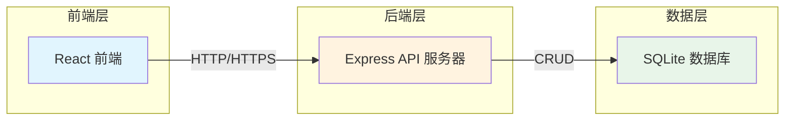
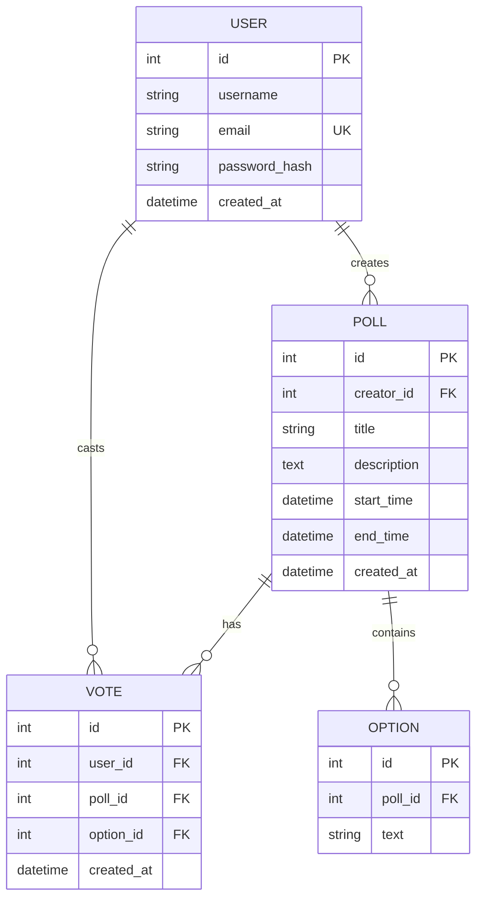

# 在线投票平台 - 技术架构文档

## 1. 架构设计

### 1.1 系统架构图



### 1.2 技术栈

| 层级 | 技术选型 | 说明 |
|------|----------|------|
| 前端框架 | React 18 | 现代化UI框架，组件化开发 |
| 构建工具 | Vite | 快速构建和热更新 |
| 样式方案 | Tailwind CSS | 原子化CSS，快速开发 |
| 后端框架 | Express 4 | 轻量级Node.js后端框架 |
| 数据库 | SQLite | 轻量级SQL数据库，易于部署 |
| ORM | better-sqlite3 | 高性能SQLite驱动 |

---

## 2. 技术详情

### 2.1 项目结构

```
/workspace
├── client/                 # 前端项目
│   ├── src/
│   │   ├── components/     # React 组件
│   │   ├── pages/          # 页面组件
│   │   ├── hooks/          # 自定义 Hooks
│   │   ├── context/        # React Context
│   │   ├── api/             # API 调用
│   │   ├── utils/          # 工具函数
│   │   └── App.jsx
│   ├── index.html
│   ├── tailwind.config.js
│   └── vite.config.js
│
├── server/                 # 后端项目
│   ├── routes/             # 路由定义
│   ├── controllers/        # 控制器
│   ├── services/           # 业务逻辑
│   ├── models/             # 数据模型
│   ├── middleware/          # 中间件
│   ├── db/                  # 数据库初始化
│   └── index.js
│
├── package.json            # 根目录 package.json
└── SPEC.md                 # 项目规格说明
```

---

## 3. 路由定义

### 3.1 前端路由

| 路径 | 组件 | 权限要求 |
|------|------|----------|
| `/` | 首页 - 投票列表 | 公开 |
| `/login` | 登录页面 | 访客 |
| `/register` | 注册页面 | 访客 |
| `/create` | 创建投票 | 需登录 |
| `/vote/:id` | 投票详情/参与 | 公开（内容受限） |
| `/my-polls` | 我的投票 | 需登录 |
| `/results/:id` | 投票结果 | 公开（需投票结束） |

### 3.2 后端 API

#### 认证相关
| 方法 | 路径 | 描述 |
|------|------|------|
| POST | `/api/auth/register` | 用户注册 |
| POST | `/api/auth/login` | 用户登录 |
| POST | `/api/auth/logout` | 用户登出 |
| GET | `/api/auth/me` | 获取当前用户信息 |

#### 投票相关
| 方法 | 路径 | 描述 |
|------|------|------|
| GET | `/api/polls` | 获取投票列表 |
| GET | `/api/polls/:id` | 获取投票详情 |
| POST | `/api/polls` | 创建投票（需登录） |
| DELETE | `/api/polls/:id` | 删除投票（需登录，仅限发起人） |
| GET | `/api/polls/my` | 获取当前用户的投票 |

#### 投票操作
| 方法 | 路径 | 描述 |
|------|------|------|
| POST | `/api/polls/:id/vote` | 提交投票（需登录） |
| GET | `/api/polls/:id/check` | 检查用户是否已投票 |

---

## 4. API 详细设计

### 4.1 用户注册

**请求**
```typescript
POST /api/auth/register
Content-Type: application/json

{
  "username": "string",    // 用户名，3-20字符
  "email": "string",        // 邮箱，格式验证
  "password": "string"      // 密码，最少6字符
}
```

**响应**
```typescript
// 成功 201
{
  "success": true,
  "data": {
    "id": "number",
    "username": "string",
    "email": "string"
  },
  "message": "注册成功"
}

// 失败 400
{
  "success": false,
  "error": "该邮箱已被注册"
}
```

### 4.2 用户登录

**请求**
```typescript
POST /api/auth/login
Content-Type: application/json

{
  "email": "string",
  "password": "string"
}
```

**响应**
```typescript
// 成功 200
{
  "success": true,
  "data": {
    "id": "number",
    "username": "string",
    "email": "string",
    "token": "string"  // JWT Token
  }
}
```

### 4.3 获取投票列表

**请求**
```typescript
GET /api/polls?status=active|ended|all
```

**响应**
```typescript
{
  "success": true,
  "data": [
    {
      "id": "number",
      "title": "string",
      "description": "string",
      "status": "active|ended",
      "startTime": "ISO date string",
      "endTime": "ISO date string",
      "options": [
        {
          "id": "number",
          "text": "string"
        }
      ],
      // 注意：进行中的投票不返回 voteCount
      "participantCount": "number" // 仅结束时返回
    }
  ]
}
```

### 4.4 获取投票详情

**请求**
```typescript
GET /api/polls/:id
```

**响应（进行中-非发起人）**
```typescript
{
  "success": true,
  "data": {
    "id": "number",
    "title": "string",
    "description": "string",
    "status": "active",
    "startTime": "ISO date string",
    "endTime": "ISO date string",
    "creatorId": "number",  // 隐藏 creatorId
    "options": [
      { "id": "number", "text": "string" }
    ],
    // 不返回 voteCount（保护隐私）
    // 不返回 participantCount
  }
}
```

**响应（进行中-发起人）**
```typescript
{
  "success": true,
  "data": {
    // ... 基础信息
    "isOwner": true,
    "options": [
      { "id": "number", "text": "string", "voteCount": "number" }
    ],
    "participantCount": "number"
  }
}
```

**响应（已结束）**
```typescript
{
  "success": true,
  "data": {
    // ... 基础信息
    "status": "ended",
    "options": [
      { "id": "number", "text": "string", "voteCount": "number" }
    ],
    "participantCount": "number"
  }
}
```

### 4.5 提交投票

**请求**
```typescript
POST /api/polls/:id/vote
Authorization: Bearer <token>
Content-Type: application/json

{
  "optionId": "number"  // 选择的选项ID
}
```

**响应**
```typescript
// 成功 200
{
  "success": true,
  "message": "投票成功"
}

// 失败 400 - 已投票
{
  "success": false,
  "error": "您已参与过此投票"
}

// 失败 400 - 投票已结束
{
  "success": false,
  "error": "投票已结束"
}
```

---

## 5. 数据模型

### 5.1 ER 图



### 5.2 数据定义语言 (DDL)

```sql
-- 用户表
CREATE TABLE users (
    id INTEGER PRIMARY KEY AUTOINCREMENT,
    username TEXT NOT NULL,
    email TEXT NOT NULL UNIQUE,
    password_hash TEXT NOT NULL,
    created_at DATETIME DEFAULT CURRENT_TIMESTAMP
);

-- 投票表
CREATE TABLE polls (
    id INTEGER PRIMARY KEY AUTOINCREMENT,
    creator_id INTEGER NOT NULL,
    title TEXT NOT NULL,
    description TEXT,
    start_time DATETIME NOT NULL,
    end_time DATETIME NOT NULL,
    created_at DATETIME DEFAULT CURRENT_TIMESTAMP,
    FOREIGN KEY (creator_id) REFERENCES users(id)
);

-- 选项表
CREATE TABLE options (
    id INTEGER PRIMARY KEY AUTOINCREMENT,
    poll_id INTEGER NOT NULL,
    text TEXT NOT NULL,
    FOREIGN KEY (poll_id) REFERENCES polls(id) ON DELETE CASCADE
);

-- 投票记录表
CREATE TABLE votes (
    id INTEGER PRIMARY KEY AUTOINCREMENT,
    user_id INTEGER NOT NULL,
    poll_id INTEGER NOT NULL,
    option_id INTEGER NOT NULL,
    created_at DATETIME DEFAULT CURRENT_TIMESTAMP,
    FOREIGN KEY (user_id) REFERENCES users(id),
    FOREIGN KEY (poll_id) REFERENCES polls(id),
    FOREIGN KEY (option_id) REFERENCES options(id),
    UNIQUE(user_id, poll_id)
);

-- 索引
CREATE INDEX idx_votes_user_poll ON votes(user_id, poll_id);
CREATE INDEX idx_options_poll ON options(poll_id);
CREATE INDEX idx_polls_status ON polls(end_time);
```

---

## 6. 安全机制

### 6.1 认证与授权
- JWT Token 用于身份验证
- Token 存储在 HTTP Only Cookie 中
- 敏感操作验证发起人身份

### 6.2 防重复投票
- 数据库层：`UNIQUE(user_id, poll_id)` 约束
- 应用层：投票前检查 `votes` 表
- 接口层：幂等性设计

### 6.3 隐私保护
- API 响应根据用户身份动态过滤数据
- 非发起人无法获取进行中投票的票数
- 实时计算投票状态（基于服务器时间）

---

## 7. 环境变量

```env
# 服务器配置
PORT=3001
NODE_ENV=development

# JWT 配置
JWT_SECRET=your-secret-key-here
JWT_EXPIRES_IN=7d

# 数据库
DB_PATH=./database.sqlite
```
