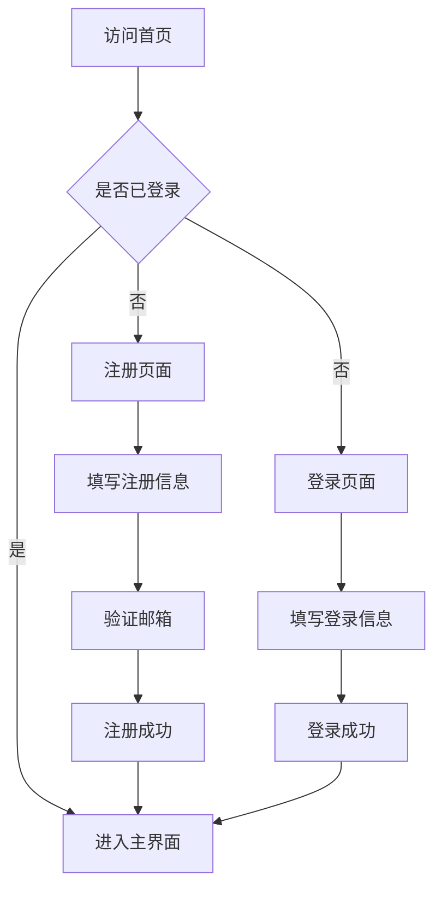
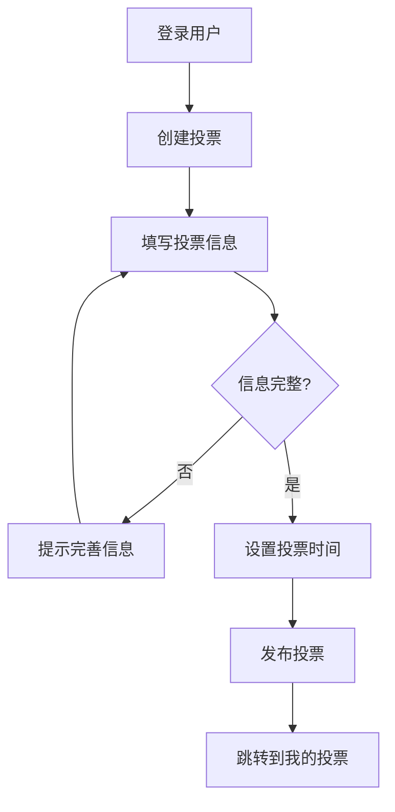
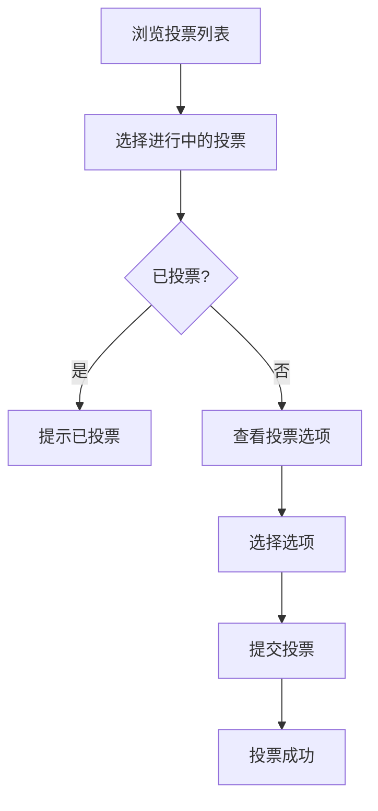

# 在线投票平台 - 产品需求文档

## 1. 产品概述

一个安全可靠的在线投票平台，支持用户注册登录、创建投票、管理投票进程，并确保投票的公平性和隐私性。

### 核心价值
- **隐私保护**：投票期间仅发起人可查看详情，结果在投票结束后公开
- **防重复投票**：通过登录验证和唯一性约束确保一人一票
- **简洁易用**：直观的界面让用户快速创建和参与投票

---

## 2. 功能模块

### 2.1 用户角色

| 角色 | 注册方式 | 核心权限 |
|------|----------|----------|
| 访客 | 无需注册 | 浏览已结束的投票结果 |
| 注册用户 | 邮箱注册 + 密码 | 创建投票、参与投票、查看自己发起的投票 |
| 投票发起人 | 注册用户 | 创建投票、管理投票、查看投票详情（仅限进行中的投票） |

### 2.2 功能模块划分

1. **认证模块**：用户注册、登录、登出、会话管理
2. **投票管理模块**：创建投票、编辑投票（仅限未开始）、删除投票
3. **投票参与模块**：查看投票列表、参与投票、投票结果查看
4. **隐私控制模块**：进行中投票的详情隐藏、结果公开机制

---

## 3. 核心流程

### 3.1 用户注册登录流程

### 3.2 创建投票流程

### 3.3 参与投票流程

---

## 4. 页面设计

### 4.1 页面清单

| 页面名称 | 功能描述 |
|----------|----------|
| 首页 | 展示进行中/已结束的投票列表 |
| 注册页面 | 用户注册表单 |
| 登录页面 | 用户登录表单 |
| 创建投票页面 | 新建投票表单 |
| 投票详情页 | 显示投票信息（根据状态显示不同内容） |
| 我的投票页面 | 管理用户发起的投票 |

### 4.2 投票状态与可见性

| 投票状态 | 发起人可见内容 | 其他用户可见内容 |
|----------|----------------|------------------|
| 进行中 | 详情 + 当前票数 | 投票选项（不可见详情） |
| 已结束 | 完整详情 + 结果 | 完整详情 + 结果 |

---

## 5. 用户界面设计

### 5.1 设计风格
- **风格定位**：现代简约 + 专业感，体现投票的严肃性和公正性
- **配色方案**：
  - 主色调：#4F46E5（靛蓝色，代表信任与专业）
  - 辅助色：#10B981（绿色，用于成功状态）
  - 警示色：#EF4444（红色，用于错误/警告）
  - 背景色：#F8FAFC（浅灰白）
  - 深色文字：#1E293B
  - 浅色文字：#64748B

### 5.2 布局方式
- 顶部导航栏：固定在顶部，包含Logo和用户菜单
- 主内容区：卡片式布局展示投票
- 响应式设计：桌面端展示多列卡片，移动端单列展示

### 5.3 交互设计
- 按钮悬停：轻微上移 + 阴影增强
- 卡片悬停：边框高亮 + 轻微缩放
- 表单验证：实时反馈 + 错误提示
- 加载状态：骨架屏占位

---

## 6. 安全与隐私设计

### 6.1 防重复投票机制
- 用户必须登录后才能投票
- 每个用户对每个投票只能投一票
- 后端记录投票历史，前端通过Cookie+后端验证双重保障

### 6.2 隐私控制
- 投票进行中：非发起人只能看到投票标题和选项，看不到当前票数和参与人数
- 投票结束后：所有用户可见完整结果
- 发起人特权：始终可查看自己发起的投票详情

---

## 7. 验收标准

### 功能验收
- [ ] 用户可以成功注册并登录
- [ ] 已登录用户可以创建新投票
- [ ] 进行中的投票：非发起人只能看到选项，不能看到票数
- [ ] 进行中的投票：发起人可以看到详情和实时票数
- [ ] 投票结束后，所有人可见投票结果
- [ ] 已投票用户无法重复投票
- [ ] 用户可以查看自己参与的投票历史

### 视觉验收
- [ ] 页面布局美观、层次分明
- [ ] 交互反馈及时、准确
- [ ] 移动端适配良好
- [ ] 加载状态友好
